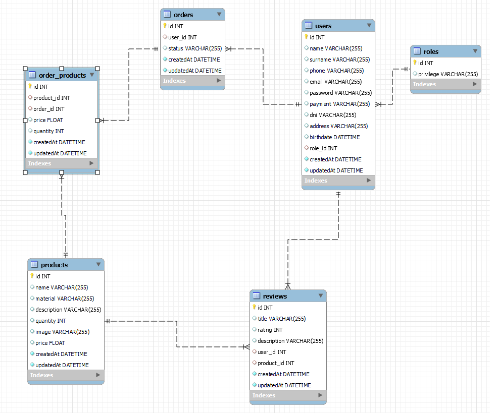

# ibebe Oficial API RestFul

<details>
  <summary>Contenido 📝</summary>
  <ol>
    <li><a href="#sobre-el-proyecto">Sobre el proyecto</a></li>
    <li><a href="#stacks">Stack</a></li>
    <li><a href="#diagrama-bd">Diagrama</a></li>
    <li><a href="#instalación-en-local">Instalación</a></li>
    <li><a href="#endpoints">Endpoints</a></li>
    <li><a href="#agradecimientos">Agradecimientos</a></li>
    <li><a href="#contacto">Contacto</a></li>
  </ol>
</details>

## Sobre el proyecto
---

Este es el proyecto final del bootcamp fullstack developer de Valencia, realizado por Jordi Jericó López. En este proyecto he realizado el backend APIRestFul de un eCommerce donde podremos ver todos los productos disponibles, loguearnos, registrarnos y realizar compras. 

Como clientes podremos: 
<ol>
<li>Registrarnos</li>
<li>Loguearnos</li>
<li>Ver todos los productos disponibles</li>
<li>Ver productos en detalle</li>
<li>Añadir productos al carrito</li>
<li>Procesar una compra</li>
<li>Ver el historial de pedidos</li>
<li>Revisar nuestro perfil</li>
<li>Actualizar nuestro perfil</li>
</ol>
Como Admin podremos:
<ol>
<li>Realizar todo lo anterior mencionado</li>
<li>Comprobar todos los usuarios registrados</li>
<li>Eliminar usuarios</li>

</ol>

---

## Stack
Tecnologías utilizadas:
<div align ="center">
</a>
<a href="https://www.expressjs.com/">
    
</a>
<a href="https://nodejs.org/es/">
    
</a>
<a href="https://developer.mozilla.org/es/docs/Web/JavaScript">
    
</a>
<a href="https://jwt.io/">
    
</a>
<a href="https://www.postman.com/">
    
</a>
<a href="https://www.mysql.com/">
    
</a>
<a href="https://www.github.com/">
    
</a>
<a href="https://git-scm.com/">
    
</a>

<a href="https://www.sequelize.org/">
    
</a>
 </div>
 
 ---

 ## Diagrama de la Base de Datos



 ---

 ## Instalación 
1. Clonar el repositorio
2. ` $ npm install `
3. Conectamos nuestro repositorio con la base de datos 
4. ``` $ Ejecutamos las migraciones: npx sequelieze-cli db:migrate ``` 
5. ``` $ Ejecutamos los seeders: npx sequelize-cli db:seed:all ``` 
6. ``` $ npm run dev ``` 

---

## Endpoints
<details>
<summary>Endpoints</summary>

- AUTH
    - REGISTER

            POST localhost:4000/auth/register
        body:
        ``` js
            {
                "name": "pepe",
                "email": "pepe@pepe.com",
                "password": "user"
            }
        ```

    - LOGIN

            POST localhost:4000/auth/login 
        body:
        ``` js
            {
                "email": "david@david.com",
                "password": "admin"
            }
        ```

- USER
    - GET PROFILE

            GET localhost:4000/user/profile

    - EDIT PROFILE

            PUT localhost:4000/user/profile/update


- PRODUCTS
    - GET ALL PRODUCTS 

            GET localhost:4000/product/allproducts

       
    - GET PRODUCT DETAIL

            GET localhost:4000/product/product/4

- ORDER_PRODUCT

    - CGET ORDER_PRODUCTS BY ORDER ID

            GET localhost:4000/orderproduct/allorderproducts/3


- ORDER
    - CREATE ORDER

            POST localhost:4000/order/createorder/

    - GET ALL ORDERS BY USER        

            GET localhost:4000/order/allorders
            
    - UPDATE ORDER STATUS    

            PUT localhost:4000/order/updateorder/6

- USERS (admin)
    - CHECK ALL USERS AS ADMIN

            GET localhost:4000/user/allusers

</details>

--- 

## Agradecimientos

Me gustaría agradecer como siempre a todos los docentes y a mis compañeros por la ayuda brindada. Muchas gracias.


## CONTACTO


<a href="https://github.com/jordijerico">
     
</a>


